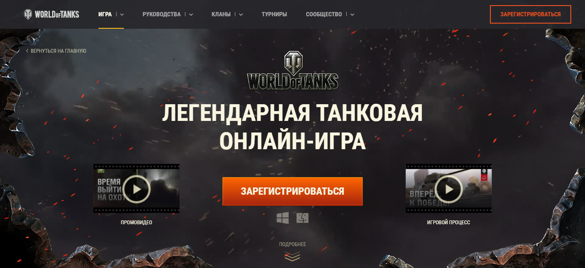
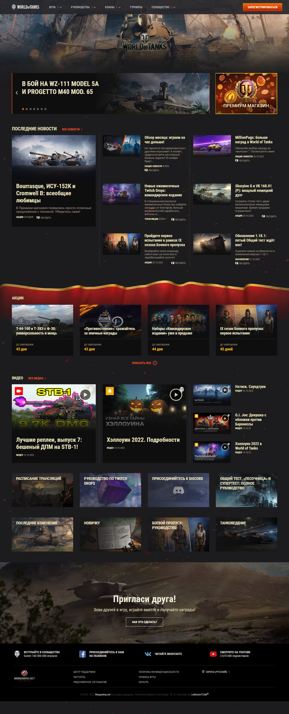
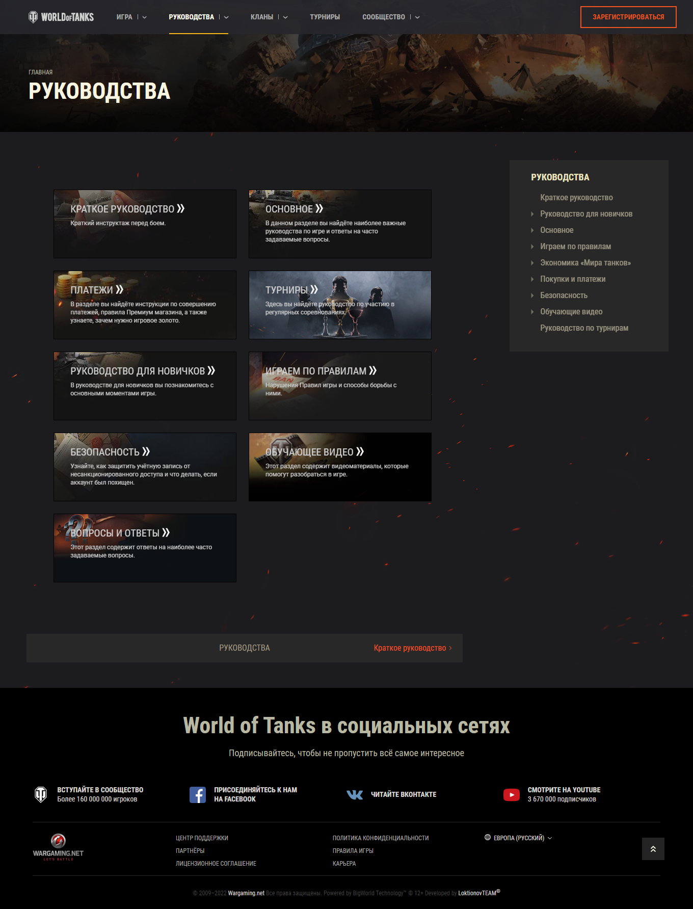
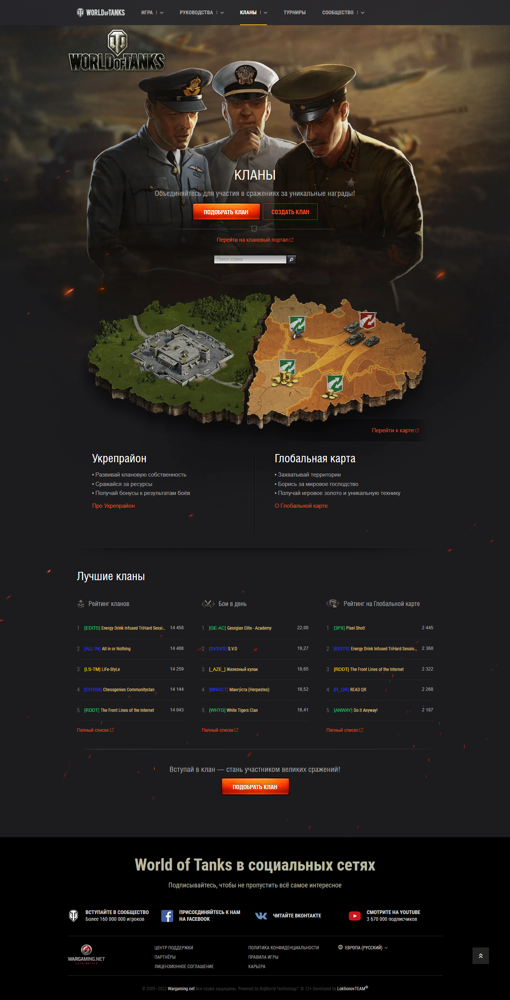
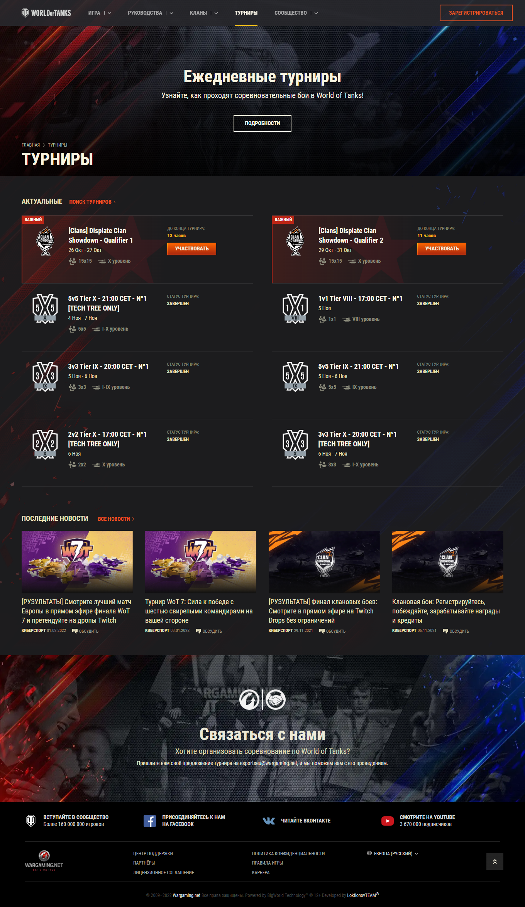
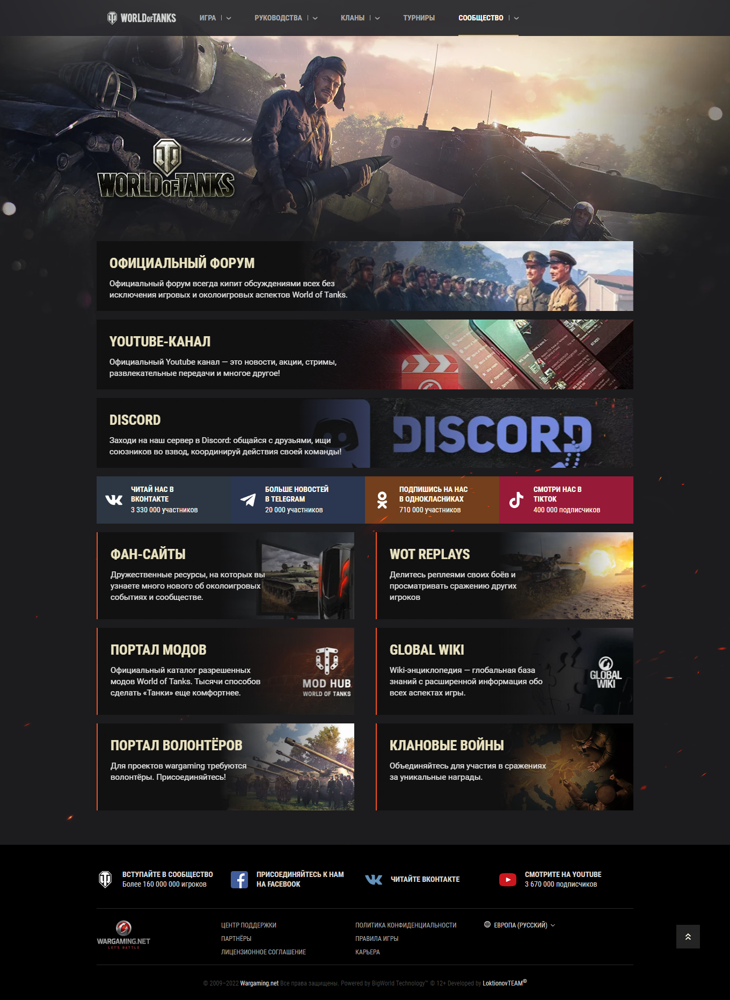
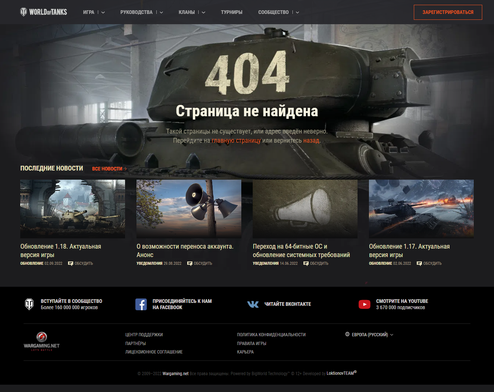
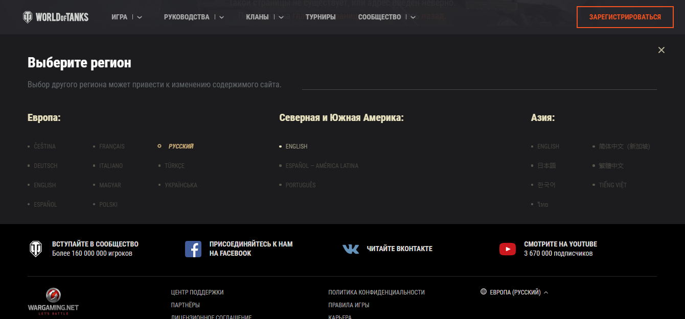
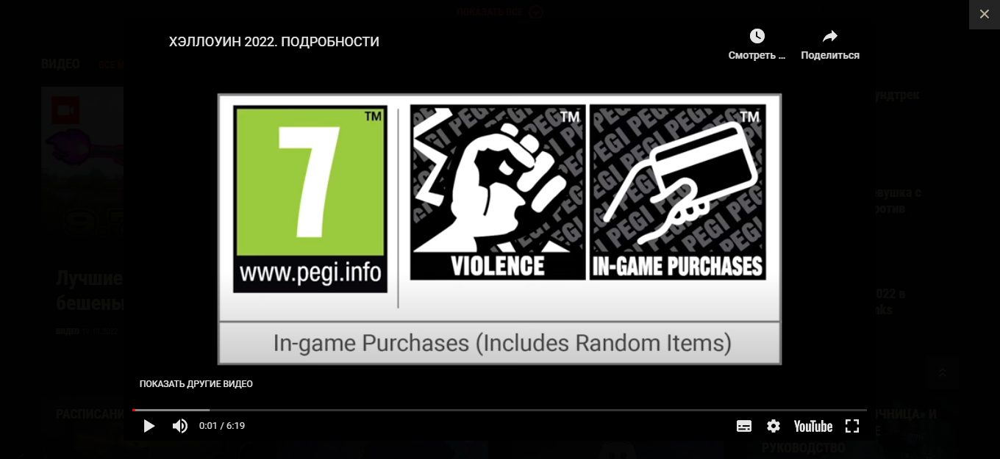
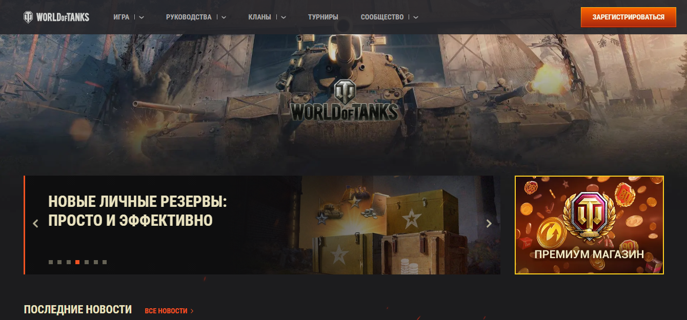

<h1 align="center" style="font-weight:bold;">
</h1>

<p align="center">
<a href="https://reactjs.org/"></a>
<a href="https://www.linkedin.com/in/loktionovteam/"></a>
<a href="https://mit-license.org/"></a>
<a href="https://github.com/LoktionovTEAM/WoT/archive/refs/heads/main.zip"></a>
</p>

<p align="center"> встречайте мое новое React приложение с открытым исходным кодом, все также реализованное с использованием последних современных технологий мира разработки. </br>
Данный проект основан на представлении всемирно известного экшена боев и танковых баталий - </br> WORLD of TANKS и является непосредственным клоном официального сайта от Wargaming. </br> В связи с этим, обращаю Ваше внимание, что некоторые из сылок приложения перенаправляют клиента на официальный сайт Мира танков.
</p>

</br>

## 🧰 **Инструменты**
| Ключевые инструменты, используемые в проекте:

| **Инструмент** | **Описание** |
| :--------------:|--------------|
| [**Figma**](https://www.figma.com/) | *онлайн-сервис, для разработки интерфейсов и прототипирования с возможностью организации совместной работы в режиме реального времени.* |
| [**VScode**](https://code.visualstudio.com/) | *легкий, но мощный редактор исходного кода, который работает на вашем рабочем столе и доступен для Windows, macOS и Linux.* |
| [**SASS**](http://sass-lang.com/) | *самый зрелый, стабильный, мощный и профессиональный язык CSS расширений в мире.* |
| [**Node**](https://nodejs.org/) | *программная платформа, основанная на движке V8, превращающая JavaScript из узкоспециализированного языка в язык общего назначения.* |
| [**React**](https://reactjs.org/) | *javaScript библиотека, для уверенного создания пользовательских интерфейсов.* |
| [**Webpack**](https://webpack.js.org/) | *сборщик статических модулей для современных JavaScript приложений.* |
| [**Babel**](https://babeljs.io/) | *цепочка инструментов, используемая для преобразования кода ECMAScript 2015+ в обратно совместимую версию JavaScript в текущих и более старых браузерах или средах.* |
| [**Redux Toolkit**](https://redux-toolkit.js.org/) | *redux библиотека, предназначенная для стандартного способа написания логики.* |
| [**TypeScript**](https://www.typescriptlang.org/) | *строго типизированный язык программирования, основанный на JavaScript.* |
| [**React-i18next**](https://www.i18next.com/) | *мощная JavaScript платформа интернационализации для React / React Native, основанная на i18next.* |
| [**Axios**](https://github.com/axios/axios) | *javaScript библиотека с открытым исходным кодом, построенная на HTTP-клиенте для браузера и Node.JS, основанном на Promise.* |
| [**JSON-server**](https://github.com/typicode/json-server) | *JavaScript библиотека для создания тестового REST API* |

</br>

## 💉 **Технологии**
| Основные технологии, используемые автором проекта:

| **Технология** | **Описание** |
| :--------------:|--------------|
| [**BEM methodology**](https://ru.bem.info/methodology/) | *компонентный подход к веб-разработке, позволяющий создавать расширяемые и повторно используемые компоненты интерфейса.* |
| [**SMACSS methodology**](http://smacss.com/) | *методология веб-разработки, для организации и написания масштабируемой и модульной CSS архитектуры.* |
| [**Desktop first**](https://desktopfirst.com/?rsd) | *подход веб-разработки, при котором разработка осуществляется для многофункциональных проектов, ориентированных в первую очереди на пользователей настольных компьютеров, планшетных устройств и смартфонов.* |
| [**Responsive web design**](https://www.rwd.education/) | *набор методов, обеспечивающих правильное отображение приложения на различных устройствах пользователя подключённых к интернету.* |
| [**Web сomponents**](https://www.webcomponents.org/) | *комплекс технологий, позволяющих создавать настраиваемые повторно используемые элементы с функциональностью, инкапсулированной отдельно от остальной части кода.* |

</br>

## 🧩 **Совместимость**
| [](http://godban.github.io/browsers-support-badges/)<br>Chrome | [](http://godban.github.io/browsers-support-badges/)<br>Firefox | [](http://godban.github.io/browsers-support-badges/)<br>Yandex | [](http://godban.github.io/browsers-support-badges/)<br>IE / Edge | [](http://godban.github.io/browsers-support-badges/)<br>Safari |
| --- | --- | --- | --- | --- |
| ✔️ last 3 versions | ✔️ last 3 versions | ✔️ last 3 versions | ✔️ IE11, ✔️ Edge | ✔️last 3 versions |

</br>

## 🚦 **Быстрый старт**
1. Клонируйте данный репозиторий, используя следующую команду в терминале: `git clone https://github.com/LoktionovTEAM/WoT.git`
2. Перейдите в соответствующий каталог с клонированным репозиторием: `cd WoT`.
3. Запустите `yarn` или `npm install` для автоматической установки всех необходимых пакетов зависимостей.
4. Запустите `yarn start` или `npm start` чтобы открыть приложение в браузере по URL адресу: `http://localhost:3000`
5. Поздравляю, только что вы развернули данное приложение у себя на клиенте.
</br>

## 📸 **Скриншоты**
<div style="display: flex; flex-wrap: wrap; gap: 1rem; margin-bottom: 2rem">
	</b></details>
<details>
<summary> Домашняя страница </summary><br><b>

</b></details>
</br>
</b></details>
<details>
<summary> Страница «Игра» </summary><br><b>

</b></details>
</br>
</b></details>
<details>
<summary> Страница «Руководства» </summary><br><b>

</b></details>
</br>
</b></details>
<details>
<summary> Страница «Кланы» </summary><br><b>

</b></details>
</br>
</b></details>
<details>
<summary> Страница «Турниры» </summary><br><b>

</b></details>
</br>
</b></details>
<details>
<summary> Страница «Сообщества» </summary><br><b>

</b></details>
</br>
</b></details>
<details>
<summary> Страница не найдена </summary><br><b>

</b></details>
</br>
</b></details>
<details>
<summary> Языковая панель </summary><br><b>

</b></details>
</br>
</b></details>
<details>
<summary> Всплывающее окно </summary><br><b>

</b></details>
</div>

## 🎬 **Видео**

</b></details>
<details>
<summary> WORLD of TANKS  </summary><br><b>
<a href="https://vk.com/video773585890_456239022"></a>
</b></details>
</br>

## 👉 **Демо:** <a href="#">*пощупать*</a> 👈

</br>

## 🔬 **Результаты тестов**

<div style="display: flex; flex-wrap: wrap; gap: 1rem; margin: 1.7rem">
</br>
</b></details>
<details>
<summary> 💻 Desktop </summary><br><b>

</b></details>
</br>
</b></details>
<details>
<summary> 📳 Mobile </summary><br><b>

</b></details>
</br>
</div>

## 📢 **Доподнительная информация**

| Вы можете использовать это програмное обеспечение в рамках лицензии `MIT`, по своему усмотрению, однако, согласно требованиям настоящей лицензии, указанное ниже уведомление об авторском праве и данные условия должны быть в обязательном порядке включены во все его копии или значимые части.


</br>

## 👽 **Разработчик**
| [LoktionovTEAM<sup>®</sup>](https://github.com/LoktionovTEAM)

</br>

## 📮 **Обратная связь**
[][website]
[][vk]
[][youtube]
[][linkedin]


[website]: https://github.com/LoktionovTEAM/
[youtube]: https://www.youtube.com/
[linkedin]: https://www.linkedin.com/in/loktionovteam/
[vk]: https://vk.com/letprogrammer

</br>
</br>

## 💰 **Поддержать разработчика**

| [Yoomoney](https://yoomoney.ru/fundraise/H166MgQTtKI.230307)


</br>

## 🔓 **Лицензия**
```js
MIT License, Copyright © 2023 LoktionovTEAM
```
